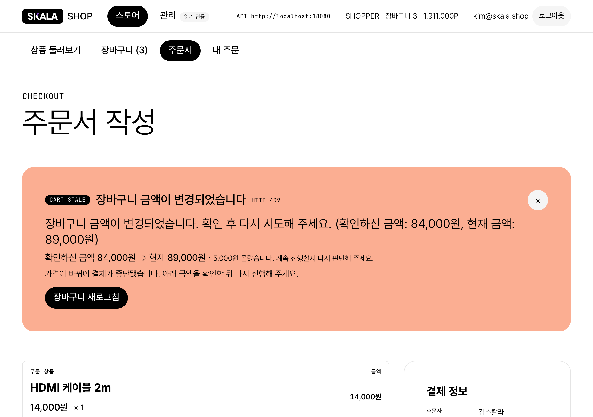
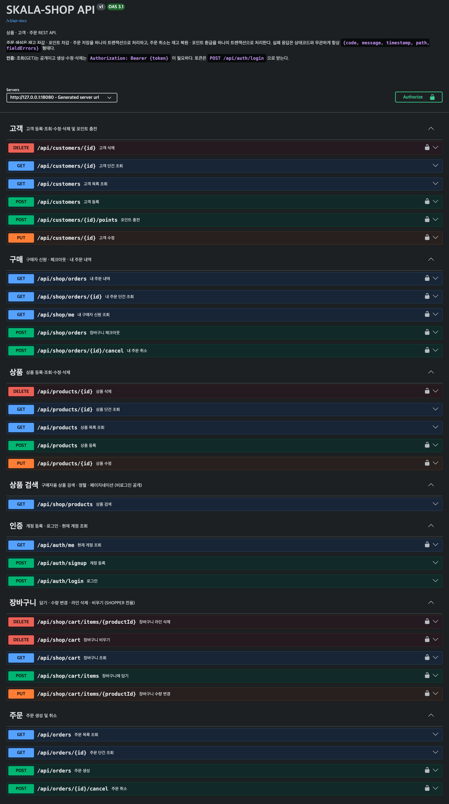
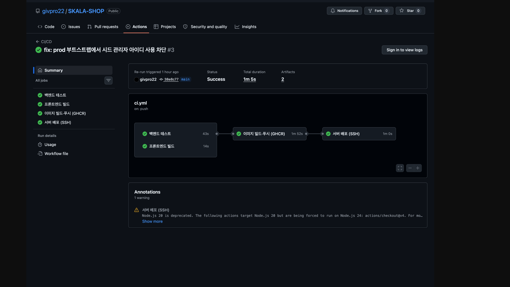

# SKALA-SHOP

상품을 검색해 장바구니에 담고 보유 포인트로 결제하는 온라인 쇼핑몰. 구매자 화면과 관리자 화면이 한 앱 안에 있고 로그인한 계정의 역할에 따라 갈린다.

**배포** http://13.125.213.176:3000/ · 백엔드 `:8080`

```
Java 21 · Spring Boot 3.5 · JPA · MySQL     React · Vite · TypeScript
Docker Compose · GitHub Actions · AWS EC2
```


## 무엇이 들어 있나

- **구매자** — 상품 검색·정렬·페이지네이션, 장바구니(담기·수량 변경·라인 삭제·비우기), 주문서, 내 주문 내역
- **관리자** — 상품·고객·주문 관리, 포인트 충전
- **인증** — JWT. 조회는 공개, 쓰기는 로그인. 관리 API는 `ADMIN`만
- 엔드포인트 29개 · 에러 코드 27종

## 결제는 하나의 트랜잭션이다

재고 차감 · 포인트 차감 · 주문 저장 · **장바구니 비우기**가 전부 하나의 `@Transactional` 안에 있다. 넷 중 하나라도 실패하면 전부 되돌아가고, 실패하면 장바구니는 손대지 않은 상태로 남아 그대로 재시도할 수 있다.

같은 상품에 주문이 동시에 들어오면 `@Version`(낙관적 락)으로 한 건만 성공하고 나머지는 `409 CONCURRENT_UPDATE`로 거부된다.

장바구니를 열어 둔 사이 가격이 바뀌면 결제를 막고 **두 금액을 함께 보여준다.**



> 금액이 내렸으면 그대로 사면 되고 올랐으면 다시 판단해야 한다. 행동이 반대라서 두 값이 다 필요하다. 버튼도 "다시 시도"가 아니라 "장바구니 새로고침"이다 — 같은 값으로 재시도하면 반드시 다시 실패하기 때문이다.

## 실행

**Docker (MySQL 포함)**

```bash
cp .env.example .env      # JWT_SECRET 등을 채운다: openssl rand -base64 48
docker compose up -d --build
```

프론트 http://localhost:3000 · 백엔드 http://localhost:8080

**로컬 개발**

```bash
cd backend  && ./gradlew bootRun --args='--spring.profiles.active=local'   # H2 + 시드 데이터
cd frontend && npm install && npm run dev
```

`local` 프로파일은 상품 20건·고객 5건·계정 6건을 시드로 넣는다. 운영 프로파일에는 시드가 실행되지 않는다.

## API 문서

`local`로 띄우면 http://localhost:8080/swagger-ui.html 에서 볼 수 있다. 실패 응답 코드까지 문서화돼 있다. **운영 배포에서는 꺼 둔다.**



## CI/CD

`main`에 push하면 **백엔드 테스트 + 프론트엔드 빌드 → 컨테이너 이미지 빌드·푸시(GHCR) → EC2 배포**까지 자동으로 돈다. 테스트가 실패하면 뒤의 두 단계는 시작하지 않는다.



배포에 필요한 값(서버 주소·접속 키·DB 비밀번호·JWT 서명키·관리자 계정)은 GitHub Actions Secrets로만 주입된다. 소스에도 이미지에도 값이 없고, 파이프라인은 배포를 시작하기 전에 필요한 값이 모두 등록돼 있는지 확인한다.

## 구조

```
backend/    Controller → Service → Repository 계층형. 엔티티 8개
frontend/   타입 → API 클라이언트 → 도메인별 훅 → 페이지
docs/       README 이미지
```
